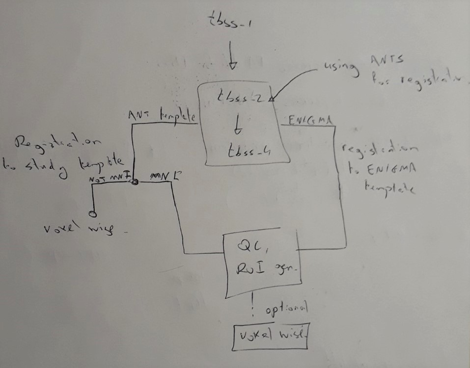

  

*TBSS* repository is developed by Tashrif Billah, Sylvain Bouix, and Ofer Pasternak, Brigham and Women's Hospital (Harvard Medical School).

Table of Contents
=================
    
   * [Table of Contents](#table-of-contents)
   * [Introduction](#introduction)
      * [1. ANTs template](#1-ants-template)
      * [2. Enigma/IIT](#2-enigmaiit)
   * [Citation](#citation)
   * [Dependencies](#dependencies)
   * [Installation](#installation)
      * [1. Install prerequisites](#1-install-prerequisites)
         * [Check system architecture](#check-system-architecture)
         * [Python 3](#python-3)
         * [FSL](#fsl)
      * [2. Install pipeline](#2-install-pipeline)
      * [3. Configure your environment](#3-configure-your-environment)
   * [Running](#running)
      * [Usage](#usage)
      * [1. With dwi/mask images](#1-with-dwimask-images)
      * [2. With modality images](#2-with-modality-images)
      * [3. With a directory](#3-with-a-directory)
   * [Tests](#tests)
      * [1. pipeline](#1-pipeline)
      * [2. unittest](#2-unittest)
   * [Multi threading](#multi-threading)
   * [NRRD support](#nrrd-support)
   * [Preprocessing](#preprocessing)
   * [Config](#config)
   * [Template](#template)
   * [List of outputs](#list-of-outputs)
      * [1. Folders](#1-folders)
      * [2. Files](#2-files)
   * [Reference](#reference)

Table of Contents created by [gh-md-toc](https://github.com/ekalinin/github-markdown-toc)

# Introduction

Generalized Tract Based Spatial Statistics (TBSS) pipeline

 

The pipeline has two branches:

## 1. ANTs template

A template is created using `antsMultivariateTemplateConstruction2.sh`. The template can be projected to a standard 
space. For human brain, it should be projected to MNI space. However, for rat/other brains, it may be some other 
standard space.

If ROI based analysis is done using a White-Matter atlas, the template should be projected to the space of the atlas.

## 2. Enigma/IIT

A standard template can be used as well. 

# Citation

If this repository is useful in your research, please cite as below: 

Billah, Tashrif; Bouix, Sylvain; Pasternak, Ofer; Generalized Tract Based Spatial Statistics (TBSS) pipeline,
https://github.com/pnlbwh/tbss, 2019, DOI: https://doi.org/10.5281/zenodo.2584275

# Dependencies

* ANTs = 2.2.0
* FSL = 5.0.11
* numpy = 1.16.2
* pandas = 1.2.1
* dipy = 0.16.0
* nibabel = 2.3.0
* pynrrd = 0.3.6
* conversion = 2.0

**NOTE** The above versions were used for developing the repository. However, *tbss* should work on 
any advanced version. 

# Installation

## 1. Install prerequisites

You may ignore installation instruction for any software module that you have already.

### Check system architecture

    uname -a # check if 32 or 64 bit

### Python 3

Download [Miniconda Python 3.6 bash installer](https://docs.conda.io/en/latest/miniconda.html) (32/64-bit based on your environment):
    
    sh Miniconda3-latest-Linux-x86_64.sh -b # -b flag is for license agreement

Activate the conda environment:

    source ~/miniconda3/bin/activate # should introduce '(base)' in front of each line

### FSL

Follow the [instruction](https://fsl.fmrib.ox.ac.uk/fsl/fslwiki/FslInstallation) to download and install FSL.

    

## 2. Install pipeline

Now that you have installed the prerequisite software, you are ready to install the pipeline:

    git clone https://github.com/pnlbwh/tbss && cd tbss
    conda env create -f environment.yml   # you may comment out any existing package from environment.yml
    conda activate tbss                   # should introduce '(harmonization)' in front of each line

Alternatively, if you already have ANTs, you can continue using your python environment by directly installing 
the prerequisite libraries:

    pip install -r requirements.txt --upgrade

## 3. Configure your environment

Make sure the following executables are in your path:

    antsMultivariateTemplateConstruction2.sh
    antsApplyTransforms
    antsRegistrationSyNQuick.sh
    tbss_1_preproc
    
You can check them as follows:

    which tbss_1_preproc
    
If any of them does not exist, add that to your path:

    export PATH=$PATH:/directory/of/executable
    
`conda activate tbss` should already put the ANTs scripts in your path. 
However, if you choose to use pre-installed ANTs scripts, you may need to define [ANTSPATH](https://github.com/ANTsX/ANTs/wiki/Compiling-ANTs-on-Linux-and-Mac-OS#set-path-and-antspath)

# Running

## Usage
Upon successful installation, you should be able to see the help message

`$ lib/tbss-pnl --help`

    usage: tbss-pnl [-h] [--modality MODALITY] -i INPUT -c CASELIST -o OUTDIR
                [--template TEMPLATE] [--templateMask TEMPLATEMASK]
                [--skeleton SKELETON] [--skeletonMask SKELETONMASK]
                [--skeletonMaskDst SKELETONMASKDST] [-s SPACE] [-l LABELMAP]
                [--lut LUT] [--qc] [--avg] [--force] [-n NCPU]

    TBSS at PNL encapsulating different protocols i.e FSL, ENIGMA, ANTs template
    etc.
    
    optional arguments:
      -h, --help            show this help message and exit
      --modality MODALITY   Modality={FA,MD,AD,RD,...} of images to run TBSS on
      -i INPUT, --input INPUT
                            a directory with one particular
                            Modality={FA,MD,AD,RD,...} images, or a txt/csv file
                            with dwi1,mask1\ndwi2,mask2\n... ; TBSS will start by
                            creating FA, MD, AD, and RD, or a txt/csv file with
                            ModImg1\nModImg2\n... ; TBSS will be done for
                            specified Modality
      -c CASELIST, --caselist CASELIST
                            caselist.txt where each line is a subject ID
      -o OUTDIR, --outDir OUTDIR
                            where all outputs are saved in an organized manner
      --template TEMPLATE   an FA image template (i.e ENIGMA, IIT), if not
                            specified, ANTs template will be created from provided
                            images, for ANTs template creation, you should
                            provided FA images, once ANTs template is created, you
                            can run TBSS on non FA images using that template
      --templateMask TEMPLATEMASK
                            mask of the FA template, if not provided, one will be
                            created
      --skeleton SKELETON   skeleton of the FA template, if not provided, one will
                            be created,either provide all three of --skeleton,
                            --skeletonMask, and --dist, or none of them
      --skeletonMask SKELETONMASK
                            mask of the provided skeleton
      --skeletonMaskDst SKELETONMASKDST
                            skeleton mask distance map
      -s SPACE, --space SPACE
                            you may register your template (including ANTs) to
                            another standard space i.e MNI, not recommended for a
                            template that is already in MNI space (i.e ENIGMA,
                            IIT)
      -l LABELMAP, --labelMap LABELMAP
                            labelMap (atlas) in standard space (i.e any
                            WhiteMatter atlas from ~/fsl/data/atlas/, the atlas is
                            used for ROI wise TBSS, default=
                            ~/fsl/data/atlases/JHU/JHU-ICBM-labels-1mm.nii.gz
      --lut LUT             look up table for specified labelMap (atlas), default:
                            FreeSurferColorLUT.txt
      --qc                  halt TBSS pipeline to let the user observe quality of
                            registration
      --avg                 average Left/Right components of tracts in the atlas
      --force               overwrite existing directory/file
      -n NCPU, --ncpu NCPU  number of processes/threads to use (-1 for all
                            available, may slow down your system)

## 1. With dwi/mask images

    -i INPUT.csv            a txt/csv file
                            with dwi1,mask1\ndwi2,mask2\n... ;

Firstly, FA, MD, AD, RD are created using either DIPY/FSL diffusion tensor models. Then, TBSS is done for 
specified modality.

## 2. With modality images 

                            a txt/csv file with
    -i INPUT.csv            ModImg1\nModImg2\n... ; TBSS will be done for specified Modality

## 3. With a directory

Alternatively, a directoy of modality images can be specified: 

      -i INPUT              a directory with one particular Modality={FA,MD,AD,RD,...} images

                        
# Tests

A small test data is provided with each [release](https://github.com/pnlbwh/tbss/releases). 

## 1. pipeline

TBD

## 2. unittest
You may run smaller and faster unittest as follows:
    
    python -m unittest discover -v lib/tests/    
    

     

# Multi threading

Processing can be multi-threaded over the cases. Besides, `antsMultivariateTemplateConstruction2.sh` utilizes 
multiple threads to speed-up template construction. 

    --nproc 8 # default is 4, use -1 for all available
   
However, multi-threading comes with a price of slowing down other processes that may be running in your system. So, it 
is advisable to leave out at least two cores for other processes to run smoothly.

# NRRD support

The pipeline is written for NIFTI image format. However, NRRD support is incorporated through [NIFTI --> NRRD](https://github.com/pnlbwh/dMRIharmonization/blob/parallel/lib/preprocess.py#L78) 
conversion on the fly.

See Billah, Tashrif; Bouix, Sylvain, Rathi, Yogesh; Various MRI Conversion Tools, 
https://github.com/pnlbwh/conversion, 2019, DOI: 10.5281/zenodo.2584003 for more details on the conversion method.

# Preprocessing

TBD

 
# Config   
    
TBD

# Template

TBD
    

# List of outputs

Several files are created down the pipeline. They are organized with proper folder hierarchy and naming:
    
## 1. Folders

    outDir
       |
    -----------------------------------------------------------------------------
       |           |             |                |        |       |
       |           |             |                |        |       |
    transform   template        FA                MD       AD      RD
                                 |       (same inner file structure as that of FA)
                                 |
                    ----------------------------------------
                     |         |         |       |        |
                    preproc  origdata  warped  skeleton  roi
    
    # copy all FA into FA directory
    # put all preprocessed data into preproc directory
    # keep all warp/affine in transform directory
    # output all warped images in warped directory
    # output all skeletons in skel directory
    # output ROI based analysis files in roi directory

## 2. Files
    
TBD

      

# Reference

S.M. Smith, M. Jenkinson, H. Johansen-Berg, D. Rueckert, T.E. Nichols, C.E. Mackay, K.E. Watkins, 
O. Ciccarelli, M.Z. Cader, P.M. Matthews, and T.E.J. Behrens. 
Tract-based spatial statistics: Voxelwise analysis of multi-subject diffusion data. NeuroImage, 31:1487-1505 

E. Garyfallidis, M. Brett, B. Amirbekian, A. Rokem, S. Van Der Walt, M. Descoteaux, 
I. Nimmo-Smith and DIPY contributors, "DIPY, a library for the analysis of diffusion MRI data", 
Frontiers in Neuroinformatics, vol. 8, p. 8, Frontiers, 2014.

Billah, Tashrif; Bouix, Sylvain, Rathi, Yogesh; Various MRI Conversion Tools, 
https://github.com/pnlbwh/conversion, 2019, DOI: 10.5281/zenodo.2584003.