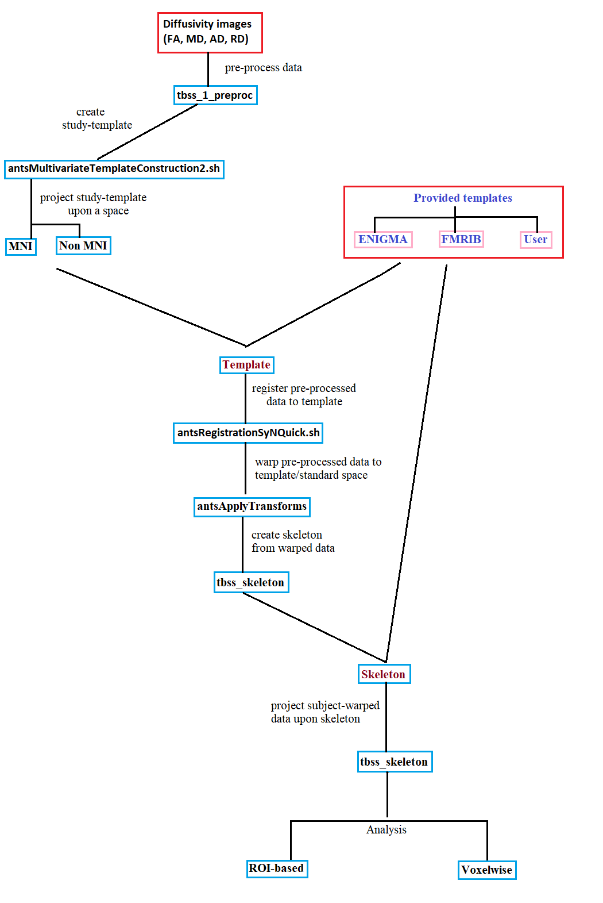
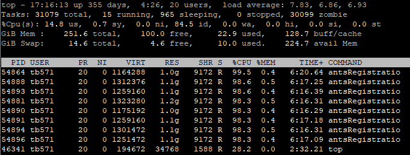
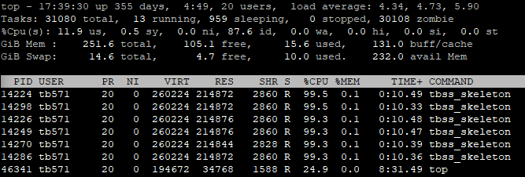

[](https://doi.org/10.5281/zenodo.2662497) []() []()

*TBSS* repository is developed by Tashrif Billah, Sylvain Bouix, and Ofer Pasternak, Brigham and Women's Hospital (Harvard Medical School).

If this repository is useful in your research, please cite as below: 

Billah, Tashrif; Bouix, Sylvain; Pasternak, Ofer; Generalized Tract Based Spatial Statistics (TBSS) pipeline,
https://github.com/pnlbwh/tbss, 2019, DOI: https://doi.org/10.5281/zenodo.2662497

See installation instruction [here](./README.md).

Table of Contents
=================

   * [Usage](#usage)
   * [Useful commands](#useful-commands)
      * [1. Run ENIGMA TBSS](#1-run-enigma-tbss)
      * [2. Run user template based TBSS](#2-run-user-template-based-tbss)
      * [3. nonFA TBSS](#3-nonfa-tbss)
      * [4. Minimum TBSS command](#4-minimum-tbss-command)
      * [5. ROI analysis](#5-roi-analysis)
      * [6. Check progress](#6-check-progress)
      * [7. Create summary](#7-create-summary)
   * [Overview](#overview)
      * [Step-1: Preprocessing](#step-1-preprocessing)
      * [Step-2: Registration](#step-2-registration)
      * [Step-3: Skeleton creation](#step-3-skeleton-creation)
      * [Step-4: Projection](#step-4-projection)
      * [Step-5: View images](#step-5-view-images)
      * [Step-6: ROI/Voxelwise analysis](#step-6-roivoxelwise-analysis)
   * [Branches/Templates](#branchestemplates)
      * [1. --enigma](#1---enigma)
      * [2. --fmrib](#2---fmrib)
      * [3. --studyTemplate](#3---studytemplate)
      * [4. User template](#4-user-template)
   * [Caselist](#caselist)
   * [Input images](#input-images)
      * [1. With dwi/mask image list](#1-with-dwimask-image-list)
      * [2. With diffusivity image list](#2-with-diffusivity-image-list)
      * [3. With diffusivity image directory](#3-with-diffusivity-image-directory)
   * [Space](#space)
   * [List of outputs](#list-of-outputs)
      * [1. Folders](#1-folders)
      * [2. Files](#2-files)
         * [i. FA/MD/AD/RD](#i-famdadrd)
            * [a. preproc](#a-preproc)
            * [b. origdata](#b-origdata)
            * [c. warped](#c-warped)
            * [d. skeleton](#d-skeleton)
            * [e. roi](#e-roi)
         * [ii. transform/template](#ii-transformtemplate)
         * [iii. log](#iii-log)
         * [iv. stats](#iv-stats)
   * [multi-modality TBSS](#multi-modality-tbss)
   * [List creation](#list-creation)
      * [1. imagelist](#1-imagelist)
      * [2. caselist](#2-caselist)
   * [Analysis](#analysis)
      * [1. ROI analysis](#1-roi-analysis)
         * [i. --lut](#i---lut)
         * [ii. --space](#ii---space)
      * [2. Voxelwise analysis](#2-voxelwise-analysis)
   * [QC](#qc)
   * [Fill holes](#fill-holes)
   * [Resource profile](#resource-profile)
   * [Multi threading](#multi-threading)
   * [NRRD support](#nrrd-support)
   * [Troubleshooting](#troubleshooting)
   * [Reference](#reference)

Table of Contents created by [gh-md-toc](https://github.com/ekalinin/github-markdown-toc)


# Usage

    usage: tbss_all [-h] [--modality MODALITY] [-i INPUT] [--generate]
                [-c CASELIST] [-o OUTDIR] [--studyTemplate] [--enigma]
                [--fmrib] [--template TEMPLATE] [--templateMask TEMPLATEMASK]
                [--skeleton SKELETON] [--skeletonMask SKELETONMASK]
                [--skeletonMaskDst SKELETONMASKDST] [-s SPACE] [-l LABELMAP]
                [--lut LUT] [--qc] [--avg] [--force] [--verbose] [-n NCPU]
                [--SKEL_THRESH SKEL_THRESH]
                [--SEARCH_RULE_MASK SEARCH_RULE_MASK] [--status]
    
    TBSS at PNL encapsulating different protocols i.e FSL, ENIGMA, ANTs template etc.
    
    optional arguments:
    -h, --help          show this help message and exit
    
    --modality MODALITY   
                        Modality={FA,MD,AD,RD...} of images to run TBSS on 
                        (i) single modality analysis: you must run --modality FA
                        first, then you can run for other modalities such as
                        --modality AD 
                        
                        (ii) multi modality analysis: first
                        modality must be FA, and then the rest i.e --modality
                        FA,MD,AD,RD,... files from FA TBSS analysis are used
                        in rest of the modalities
                        
                        
    -i INPUT, --input INPUT
    
                        (i) DWI images and masks: a txt/csv file with
                        dwi1,mask1\ndwi2,mask2\n... ; TBSS will start by
                        creating FA, MD, AD, and RD; additionally, use
                        --generate flag 
                        
                        (ii) single modality analysis: a
                        directory with one particular
                        Modality={FA,MD,AD,RD,...} images, or a txt/csv file
                        with ModImg1\nModImg2\n... TBSS will be done for
                        specified Modality 
                        
                        (iii) multi modality analysis:
                        comma-separated multiple input directories
                        corresponding to the sequence of --modality, or a
                        txt/csv file with
                        Mod1_Img1,Mod2_Img1,...\nMod1_Img2,Mod2_Img2,...\n...
                        ; TBSS will be done for FA first, and then for other
                        modalities. 
                        
                        (iv) separate nonFA TBSS: if you wish to
                        run TBSS for other modalities in future, files created
                        during FA TBSS will be integrated into the nonFA TBSS.
                        Provide the same --outDir as that of FA TBSS.
                        All other directories will be realized relative to --outDir.
                        On the other hand, provide --input and --modality in the same way
                        as you would provide for FA TBSS.
    
    --generate          generate diffusion measures for dwi1,mask1\n... list
    
    -c CASELIST, --caselist CASELIST
                        caselist.txt where each line is a subject ID
    
    -o OUTDIR, --outDir OUTDIR
                        where all outputs are saved in an organized manner,
                        for separate/future nonFA TBSS--it must be the same as
                        that of previous FA TBSS where all outputs are saved in an organized manner
    
    --studyTemplate     create all of template, templateMask, skeleton, skeletonMask, and skeletonMaskDst
    
    --enigma            use ENGIMA provided template, templateMask, skeleton,
                        skeletonMask, and skeletonMaskDst, do JHU white matter
                        atlas based ROI analysis using ENIGMA look up table
    
    --fmrib             use FSL provided template, and skeleton
    
    --template TEMPLATE   
                        an FA image template (i.e ENIGMA, IIT), if not
                        specified, ANTs template will be created from provided
                        images, for ANTs template creation, you must provide
                        FA images, once ANTs template is created, you can run
                        TBSS on non FA images using that template
    
    --templateMask TEMPLATEMASK
                        mask of the FA template, if not provided, one will be created
    
    --skeleton SKELETON          
                        skeleton of the FA template, if not provided, one will be created
    
    --skeletonMask SKELETONMASK  
                        mask of the provided skeleton
                        
    --skeletonMaskDst SKELETONMASKDST 
                        skeleton mask distance map
                        
    -s SPACE, --space SPACE
                        you may register your template (including ANTs) to
                        another standard space i.e MNI, not recommended for a
                        template that is already in MNI space (i.e ENIGMA,
                        IIT)
    
    -l LABELMAP, --labelMap LABELMAP
                        labelMap (atlas) in standard space (i.e any
                        WhiteMatter atlas from ~/fsl/data/atlases/
    
    --lut LUT           look up table for specified labelMap (atlas)
    
    --qc                halt TBSS pipeline to let the user observe quality of registration
    
    --avg               average Left/Right components of tracts in the atlas
    
    --force             overwrite existing directory/file
    
    --verbose           print everything to STDOUT
    
    -n NCPU, --ncpu NCPU  
                        number of processes/threads to use (-1 for all
                        available, may slow down your system, default 4)
    
    --SKEL_THRESH SKEL_THRESH
                        threshold for masking skeleton and projecting FA image
                        upon the skeleton, default 0.2
    
    --SEARCH_RULE_MASK SEARCH_RULE_MASK                        
                        search rule mask for nonFA TBSS, see "tbss_skeleton
                        --help", default /home/tb571/fsl/data/standard/LowerCingulum_1mm.nii.gz
    
    --status            prints progress of TBSS pipeline so far
    
    --noFillHole        do not fill holes inside the brain in diffusion measure
    
    --noAllSkeleton     do not merge skeletons
    
    --noHtml            do not generate summary.html file containing screenshots of axial, lateral, and sagital views


# Useful commands

## 1. Run ENIGMA TBSS

See details on [ENIGMA](http://enigma.ini.usc.edu/wp-content/uploads/DTI_Protocols/ENIGMA_TBSS_protocol_USC.pdf) TBSS.
    
     lib/tbss_all -i IMAGELIST.csv \
    -c CASELIST.txt \
    --modality FA,MD,AD,RD 
    --enigma \
    -o ~/enigmaTemplateOutput/
    
`IMAGELIST.csv` is a list of FA,MD,AD,RD images in separate columns. A particular diffusivity images for all cases need 
**NOT** to be in the same directory. Rather, they can be anywhere in your machine. Just make sure to specify absolute 
path to the diffusivity image in designated column of `IMAGELIST.csv`. See details in [ENIGMA branch](#1---enigma).

**NOTE** For multi-modality TBSS like above, make sure to have FA as the first modality.


    
## 2. Run user template based TBSS
    
    lib/tbss_all -i FAimageDIR,MDimageDIR \
    --modality FA,MD \
    -c CASELIST.txt \
    --template your_FA.nii.gz \
    --skeleton your_skeleton_FA.nii.gz \
    -o ~/userTemplateOutput/

Alternative to the `IMAGELIST.csv` in the above, you can specify a directory corresponding to each modality you want to analyze. 
However, you have to copy your diffusivity images in a directory. In the very least, the images across `FAimageDIR,MDimageDIR` 
should have caseID from `CASELIST.txt` somewhere in their file names. But it doesn't need to have keyword "FA/MD" in their file names.

On the other hand, `your_FA.nii.gz` and `your_skeleton_FA.nii.gz` are the templates you should provide. 
See details in [User template branch](#4-user-template).


## 3. nonFA TBSS

The best way to perform nonFA TBSS is running together with FA such as `--modality FA,MD,AD --input faDir,mdDir,adDir`.
However, if you want to run nonFA TBSS at a future date based on FA template/registration, you can do as follows:

**nonFA** `--engima` TBSS
    
    $libDir/tbss_all -i MD/origdata,RD/origdata \
    -o $testDir/enigmaTemplateOutput/ \ # transform files are obtained from here
    --modality MD,RD --enigma           # --enigma tells to use enigma templates

**nonFA** `--studyTemplate` TBSS

    $libDir/tbss_all -i AD/origdata \
    -o $testDir/studyTemplateOutput/ \
    --modality AD \
    --studyTemplate                     # --studyTemplate tells to use previous templates from studyTemplateOutput/stats/*


A few other arguments are obtained by parsing previous command stored in `*TemplateOutput/log/commands.txt` file. In a nut-shell,
nonFA TBSS would run under the same settings of FA TBSS.


## 4. Minimum TBSS command
    
    lib/tbss_all -i FAimageDIR \
    -c CASELIST.txt \
    -o ~/fmribuserTemplateOutput
    
Voila! The pipeline will create a study specific template. Default `--modality` is assumed to be **FA**. See details in 
[study template branch](#3---studytemplate).


## 5. ROI analysis

With all the above, you may provide an atlas and a [space](#-space) of the atlas defining image. Then, [ROI based statistics](#roi-analysis) 
will be calculated.

    --labelMap JHU-ICBM-labels-1mm.nii.gz \
    --lut data/ENIGMA_look_up_table.txt \
    --space $FSLDIR/data/standard/FMRIB58_FA_1mm.nii.gz

Even better, [ENGIMA](#1---enigma) branch does ROI based analysis as default.


## 6. Check progress

If you have a good number of cases to process, and you would like to know how far the pipeline has progressed, 
do the following:

    lib/tbss_all --status --outDir ~/userTemplateOutput/

The `--status` command uses information from `outDir/log/config.ini` to collect information about the ongoing TBSS study. It will print a dashboard like below:

    Output directory:               ~/my_output_directory
    Number of cases to process:     228
    
    Progress of FA TBSS:
    
    origdata obtained:              228
    pre-processed:                  228
    registered to template space:   228
    skeletonized:                   228
    roi-based stat calculated:      228
    
    Time taken so far: 2 days, 17 hours, 54 minutes and 3 seconds

Amazing, isn't it! 

 
## 7. Create summary

Finally, TBSS pipeline can generate an HTML file with skeleton overlaid upon the diffusivity measure for all cases.
As of recent enhancements, HTML file is generated by default. Yet, see the following examples for generating it separately:

    lib/writeHtml.py --dir tbss/output/directory --modality MD --ncpu 8
    lib/writeHtml.py --dir tbss/output/directory --cut_coords enigma # default --modality is FA 
    lib/writeHtml.py --dir tbss/output/directory --cut_coords fmrib  # default --modality is FA 
    lib/writeHtml.py --dir tbss/output/directory --modality FW --cut_coords 1,-19,14 (comma separated, no spaces)
    
The default `--cut_coords` is `auto` which resolves to the method `find_xyz_cut_coords(img, mask_img=None, activation_threshold=None)` 
defined in [nilearn.plotting.find_cuts](https://github.com/nilearn/nilearn/blob/master/nilearn/plotting/find_cuts.py).
However, we experimentally devised `--cut_coords enigma` == `1,-19,14` and `--cut_coords fmrib`== `-17,-24,14` for fixing the cut coordinates 
to be used across all images in a study.
    
    
    

# Overview

This is Generalized Tract Based Spatial Statistics (TBSS) pipeline,
encompassing different protocols such as [ENIGMA](http://enigma.ini.usc.edu/wp-content/uploads/DTI_Protocols/ENIGMA_TBSS_protocol_USC.pdf) 
and [FSL](https://fsl.fmrib.ox.ac.uk/fsl/fslwiki/TBSS/UserGuide). It is elegantly designed so you no longer have to 
deal with naming your folders/files according to a protocol. It uses some command line tools relevant to 
skeleton creation from FSL while replacing all FSL (i.e `flirt`, `applyWarp` etc) registration steps by [ANTs](https://github.com/ANTsX/ANTs). 
In a nutshell, this pipeline should facilitate an user in running TBSS study by giving more liberty with inputs. 
Moreover, it harnesses multiprocessing capability from Python making the program significantly faster than any 
job scheduling framework (i.e lsf).




## Step-1: Preprocessing

`tbss_1_preproc *.nii.gz` pre-processes the FA images. It essentially zeros the end slices and erodes the image a little bit. 
It also creates `caseid_FA_mask.nii.gz` that can be used to pre-process non-FA images. `tbss_1_preproc` puts the given FA 
images in [origdata](#origdata) and pre-processed FA images in `FA` directory. The pipeline renames the latter to [preproc](#a-preproc).

As explained above, non-FA images are pre-processed by applying `caseid_FA_mask.nii.gz` directly.


## Step-2: Registration

Each `caseid_FA.nii.gz` are registered to template space. The `caseid_*1Warp.nii.gz` and `caseid_*0GenericAffine.mat` 
transform files are stored in [transform/template](#ii-transformtemplate) directory.

The warp and affine are used to warp `caseid_FA.nii.gz` to template space: `caseid_FA_to_target.nii.gz`. The warped images 
are saved in [warped](#c-warped) directory. Same warp and affine are used to warp non-FA images.

**NOTE** If you re-run a study and provided that registration files exist, they will not be re-created. To re-create them, 
use `--force` flag or delete [transform/template](#ii-transformtemplate) directory manually. This bypassing would be useful for 
quick re-run after adjusting few parameters such as `args.SKEL_THRESH`.


## Step-3: Skeleton creation

If a skeleton is not provided, it is created by `tbss_skeleton` command. `stats/meanFA.nii.gz` is used to create skeleton. 
The `stats/meanFA.nii.gz` is obtained from all the warped images in `warped` directory.

## Step-4: Projection

Each subject diffusivity image is projected upon provided/created skeleton: `{modality}/skeleton/caseid_{modality}_to_target_skel.nii.gz`. 
See `tbss_skeleton --help` for more details about how FA and non-FA images are projected upon skeleton. Also, read [Smith's 
TBSS 2006](https://www.ncbi.nlm.nih.gov/pubmed/16624579) paper to know more about it.


## Step-5: View images

TBSS pipeline generates an HTML file with skeleton overlaid upon the diffusivity measure for all cases.
A `slicesdir` folder is created inside each modality directory in `tbss/output/directory`. `nilearn` package is used to 
save *.png* files with skeleton overlaid upon diffusivity measure for all cases in `tbss/output/directory/log/caselist.txt`.
Finally, `slicesdir/summary.html` file is generated with reference to all *.png* files. Looking at `slicesdir/summary.html`, 
user should be able to assess quality of registration, projection etc. and potentially re-run the pipeline omitting bad cases.


## Step-6: ROI/Voxelwise analysis

Finally, we would like to do analysis on skeletonized data. ROI-based analysis can be done as noted in the [ENIGMA protocol](http://enigma.ini.usc.edu/wp-content/uploads/DTI_Protocols/ENIGMA_ROI_protocol_USC.pdf).
In brief, each `caseid_FA_to_target_skel.nii.gz` is compared against an atlas. The atlas has multiple segments. We calculate
average diffusivity (FA,MD etc.) of each segment and note them in a csv file: `{modality}/roi/caseid_{modality}_roi*.csv`.

Summary of ROI analysis is saved in `stats/{modality}_combined_roi*csv`. The process is detailed in [ROI analysis](#roi-analysis).

On the other hand, skeletonized 4D data `stats/all{modality}_skeletonized.nii.gz` can be used to do [voxelwise analysis](https://fsl.fmrib.ox.ac.uk/fsl/fslwiki/TBSS/UserGuide#voxelwise_statistics_on_the_skeletonised_FA_data). 
 

# Branches/Templates

The pipeline has four branches:


## 1. --enigma

ENIGMA provided templates are used with this argument:
    
    enigmaDir= pjoin(LIBDIR, 'data', 'enigmaDTI')
    args.template = pjoin(enigmaDir, 'ENIGMA_DTI_FA.nii.gz')
    args.templateMask = pjoin(enigmaDir, 'ENIGMA_DTI_FA_mask.nii.gz')
    args.skeleton = pjoin(enigmaDir, 'ENIGMA_DTI_FA_skeleton.nii.gz')
    args.skeletonMask = pjoin(enigmaDir, 'ENIGMA_DTI_FA_skeleton_mask.nii.gz')
    args.skeletonMaskDst = pjoin(enigmaDir, 'ENIGMA_DTI_FA_skeleton_mask_dst.nii.gz')
    args.lut = pjoin(enigmaDir, 'ENIGMA_look_up_table.txt')
    
In addition, the following atlas is used for ROI based analysis:
    
    args.labelMap = pjoin(fslDataDir, 'atlases', 'JHU', 'JHU-ICBM-labels-1mm.nii.gz')

## 2. --fmrib

FSL provided templates are used with this argument:
    
    args.template= pjoin(fslDataDir, 'standard', 'FMRIB58_FA_1mm.nii.gz')
    args.skeleton= pjoin(fslDataDir, 'standard', 'FMRIB58_FA-skeleton_1mm.nii.gz')
 
On the other hand, this branch does not do ROI based analysis by default. If wanted, the 
user should specify an atlas, corresponding space (if atlas and templates are in different space), and look-up-table
as follows:

    --labelMap atlas.nii.gz -lut my_look_up_table.txt --space MNI.nii.gz
    

Unlike [original TBSS](https://fsl.fmrib.ox.ac.uk/fsl/fslwiki/TBSS/UserGuide) approach, we use the [ENIGMA](http://enigma.ini.usc.edu/wp-content/uploads/DTI_Protocols/ENIGMA_ROI_protocol_USC.pdf) approach 
that identifies the direction of projection onto the skeleton based on the individual FA maps rather than on the mean FA map.


## 3. --studyTemplate

With this branch, a study-specific template is created using `antsMultivariateTemplateConstruction2.sh`. 
`tbss_1_preproc INPUTDIR/*.nii.gz` pre-processes the given FA images. 
The pre-processed FA images are used in template construction. Again, the use should provide 
a set of FA images for study specific template construction. 

## 4. User template

Finally, the user can specify any or all of the following:
    
    --template TEMPLATE                 an FA image template (i.e ENIGMA, IIT), 
                                        if not specified, ANTs template will be created from provided images, 
                                        for ANTs template creation, you must provide FA images, 
                                        once ANTs template is created, you can run TBSS on 
                                        non FA images using that template
                                        
    --templateMask TEMPLATEMASK         mask of the FA template, if not provided, one will be created
        
    --skeleton SKELETON                 skeleton of the FA template, if not provided, one will be created
                                        
    --skeletonMask SKELETONMASK         mask of the provided skeleton
    
    --skeletonMaskDst SKELETONMASKDST   skeleton mask distance map
    

** NOTE ** Attributes provided as user templates are mutually exclusive to the ones default with branches specified above. 
In other words, branch specific templates have precedence over user template. 
For example, if `--enigma` is specified, it will override `--template`, `--skeleton` etc specified again.
However, since `--fmrib` comes with only `--template` and `--skeleton`, 
you should specify `--templateMask`, `--skeletonMask` etc. with it. 


# Caselist

File names in each subdirectory start with a caseid obtained from `--caselist`. 
There must be one caseid in each line:
    
    case1
    case2
    case3
    ...
    

# Input images

The TBSS pipeline requires input images i.e. FA, MD etc. You may specify the input images as a list 
or as a directory which contains them.

### 1. With dwi/mask image list

For convenience, TBSS can start by creating diffusivity measures: FA, MD, AD, and RD. To let the pipeline create them, 
specify your input DWI/Mask in a text file as follows:

    -i INPUT.csv            a txt/csv file
                            with dwi1,mask1\ndwi2,mask2\n...

In addition, provide the `--generate` flag.

**NOTE** There must be one dwi,mask pair in each line, separated by comma:

    dwi1,mask1
    dwi2,mask2
    dwi3,mask3
    ...


Then, FA, MD, AD, RD are created using either DIPY/FSL diffusion tensor models. The model and 
associated cost function can be specified by environment variables `DTIFIT_TOOL` and `COST_FUNC` 
respectively:

```
    export DTIFIT_TOOL=FSL # default DIPY
    export COST_FUNC=WLS   # default LS (least squares/weighted least squares)
```

Finally, TBSS is done for specified `--modality`.


### 2. With diffusivity image list 

Alternatively, you can specify a list of diffusivity images sitting in different directories:

                            a txt/csv file with
    -i INPUT.csv            ModImg1\nModImg2\n... ; TBSS will be done for specified Modalities

The pipeline will organize them in proper [directory structure](#1-folders).


**NOTE** Let's say you have two modalities FA and MD and one `INPUT.csv`. Then, you would use:

    -i INPUT.csv --modality FA,MD
    
where `INPUT.csv` looks like following:

    /path/to/FA/image1,/path/to/MD/image1
    /path/to/FA/image2,/path/to/MD/image2
    /path/to/FA/image3,/path/to/MD/image3
    ...

As you see, first column corresponds to FA images, while the comma separated second column corresponds to MD images.


### 3. With diffusivity image directory

Finally, to be compatible with FSL/ENGIMA protocols, you may organize your diffusivity images in separate directories. 
Then, you can provide the directories to run TBSS on:
    
    --modality FA,MD,... dir/of/FA/images,dir/of/MD/images,...
    
**NOTE** When specifiying multiple modalities at a time, make sure to correspond your directory to the right modality.


# Space

Provided or created template can be projected to a standard space. For human brain, it should be projected to MNI space. 
However, for rat/other brains, it may be some other standard space. 

If ROI based analysis is to be done using a White-Matter atlas, the template should be projected to the space of the atlas.


# List of outputs

Several files are created down the pipeline. They are organized with following folder hierarchy and naming:
    
## 1. Folders
    
    outDir
       |
    ------------------------------------------------------------------------------------------------------
       |           |             |                |        |       |                   |           |
       |           |             |                |        |       |                   |           |
    transform   template        FA                MD       AD      RD                 log        stats
                                 |       (same inner file structure as that of FA)
                                 |
                    ----------------------------------------
                     |         |         |       |        |
                    preproc  origdata  warped  skeleton  roi
    
    copy all FA into FA directory
    put all preprocessed data into preproc directory
    keep all warp/affine in transform directory
    output all warped images in warped directory
    output all skeletons in skel directory
    output ROI based analysis files in roi directory
    save all ROI statistics, mean, and combined images
    
        
    
## 2. Files
    
The following directories are created inside user specified output directory. Files residing in the nested directories 
are explained below:

### i. FA/MD/AD/RD

TBSS run on one or more specified modalities. The FA, MD, .. directories correspond to the modalities. In each modality 
directory, there are five sub-directories:
    
                FA
                 |
                 |
    ----------------------------------------
     |         |         |       |        |
    preproc  origdata  warped  skeleton  roi
    
    copy all FA into FA directory
    put all preprocessed data into preproc directory
    keep all warp/affine in transform directory
    output all warped images in warped directory
    output all skeletons in skel directory
    output ROI based analysis files in roi directory
    

Files in each subdirectory start with a caseid obtained from `--caselist`.

#### a. preproc

Contains all [tbss_1_preproc](https://fsl.fmrib.ox.ac.uk/fsl/fslwiki/TBSS/UserGuide#tbss_1_preproc) processed data.

#### b. origdata

Contains raw diffusivity data. 

In fact `tbss_1_preproc` categorizes raw and preprocessed data into `origdata` and `FA` directories, respectively. 
The pipeline renames `FA` as `preproc` to be harmonious with the genre of data contained within.

#### c. warped

Preprocessed data are warped to template/standard space applying warp and affine obtained from registering each subject 
to the template. `warped` directory contains warped data.

#### d. skeleton

Each subject diffusivity image is projected upon provided/created skeleton. This directory contains projected skeletons in subject space.

#### e. roi

If you choose to do ROI based analysis providing a `--labelMap`, then a `*_roi.csv` file is created for each case containing 
region based statistics. Additionally, if you use `--avg` flag, RIGHT/LEFT regions in the ROIs are averaged. The averaged 
statistics are saved in `*_roi_avg.csv` file.


Several files are created down the pipeline. They are organized with proper folder hierarchy and naming:


    outDir
       |
    -------------------------------------------------------------------------
           |                |       |       |       |        |        |
           |                |       |       |       |        |        |
    transform/template     FA       MD      AD      RD      log     stats
    
### ii. transform/template

If a template is given, input images are registered with the template. On the other hand, if a template is not 
given/`--studyTemplate` branch is specified, a template is created in the pipeline at `template` directory. 
Corresponding transform files: `*0GenericAffine.mat` and `*1Warp.nii.gz` are created in `transform/template` directory.

Moreover, same directory is used to store transform files if a template is further registered to another space (i.e. MNI).

### iii. log

ANTs registration logs are stored in this directory for each case starting with a caseid. However, the user can print 
all the outputs to `stdout` by `--verbose` option. In addition, all commands ran before along with when it was run, 
are stored in `log/commands.txt` file.


### iv. stats

As the name suggests, all statistics are saved in this directory. Statistics include mean and combined modality images, 
csv file containing summary of region based statistics etc.


# multi-modality TBSS

Unlike requiring to save nonFA TBSS files with a particular name as directed by some protocol, this pipeline is capable of 
running multi-modality TBSS with any name for input images. All you have to do is, make sure first modality in 
the specified modalities is FA and corresponding input images are FA. 
Rest of the modalities should also correspond to rest of the images.


    --modality MODALITY         Modality={FA,MD,AD,RD ...} of images to run TBSS on
            
                                (i) single modality analysis:
                                you must run --modality FA first, then you can run for other modalities such as --modality AD
            
                                (ii) multi modality analysis:
                                first modality must be FA, and then the rest i.e --modality FA,MD,AD,RD,...
                                files from FA TBSS analysis are used in rest of the modalities
                                
    -i INPUT, --input INPUT
                                (i) DWI images and masks:
                                a txt/csv file with dwi1,mask1\ndwi2,mask2\n... ; TBSS will start by creating FA, MD, AD, and RD;
                                additionally, use --generate flag
            
                                (ii) single modality analysis:
                                a directory with one particular Modality={FA,MD,AD,RD,...} images, or
                                a txt/csv file with ModImg1\nModImg2\n...
                                TBSS will be done for specified Modality
            
                                (iii) multi modality analysis:
                                comma-separated multiple input directories corresponding to the sequence of --modality, or
                                a txt/csv file with Mod1_Img1,Mod2_Img1,...\nMod1_Img2,Mod2_Img2,...\n... ;
                                TBSS will be done for FA first, and then for other modalities.
    
                                (iv) separate nonFA TBSS: if you wish to
                                run TBSS for other modalities in future, files created
                                during FA TBSS will be integrated into the nonFA TBSS.
                                Provide the same --outDir as that of FA TBSS.
                                All other directories will be realized relative to --outDir.
                                On the other hand, provide --input and --modality in the same way
                                as you would provide for FA TBSS.


However, if you wish to run FA first and then other modalities in future, use option (iv) from above. There, you should 
provide the same `--outDir` as that of FA TBSS. The `--outDir` has a `transform` directory containing warp/affine obtained 
during registration of subject FA to the template/standard space. 
This way, we bypass doing the same non-linear registration once again. In addition, provide the type/branch name (one of 
`enigma`, `fmrib`, `study`) of TBSS you want to run. Previous registration files and any templates created during 
FA TBSS are realized with respect to `--outDir` that you provide. Furthermore, `log/commands.txt` file from previous 
output directory is exploited to figure out arguments provided to FA TBSS before. In a nutshell, nonFA TBSS will run 
with the same settings of previous FA TBSS. 


Here are a few sample commands for running separate nonFA TBSS:

    
**nonFA** `--engima` TBSS
    
    $libDir/tbss_all -i MD/origdata,RD/origdata \
    -o $testDir/enigmaTemplateOutput/ \             # transform files are obtained from here
    --modality MD,RD --enigma                       # --enigma tells to use enigma templates


**nonFA** `--studyTemplate` TBSS

    $libDir/tbss_all -i AD/origdata \
    -o $testDir/studyTemplateOutput/ \
    --modality AD \
    --studyTemplate                                 # --studyTemplate tells to use previously created templates from studyTemplateOutput/stats/*


# List creation

## 1. imagelist

You can easily generate list of your FA images as follows:

    cd projectDirectory
    ls `pwd`/000????/eddy/FA/*_FA.nii.gz > imagelist.txt

Here, we have a bunch of cases in the project directory whose IDs start with `000` and is followed by 
four alphanumeric characters. The directory structure to obtain FA images is `000????/eddy/FA/`. Inside the 
directory, we have an FA image ending with `_FA.nii.gz`.

**NOTE**: `pwd` is used to obtain absolute path


Similarly, you can generate a list of your dwis,masks as follows:
    
    cd projectDirectory
    touch dwi_mask_list.txt
    for i in GT_????
    do 
        echo `pwd`/$i/${i}_dwi_xc.nii.gz,`pwd`/$i/${i}_dwi_xc_mask.nii.gz >> dwi_mask_list.txt;
    done
    
In the above example, we have a bunch of cases with IDs GT_???? having separate folders.  
The dwis of the cases follow the pattern `ID_dwi_xc.nii.gz` and corresponding masks follow the pattern  
`ID_dwi_xc_mask.nii.gz`.

In the same way, you can define your file structure and file names to obtain an image/case list.


## 2. caselist

For just caselist, you can do:

    cd projectDirectory
    ls 000???? > caselist.txt 
    
Use of `????` is detailed above.
 

# Analysis

## 1. ROI analysis

`--enigma` and `--fmrib` branch of the pipeline performs ROI based analysis as default. The way it works is, each of the 
projected skeleton in subject space is superimposed upon a binary label map. The binary label map of each ROI is obtained from 
each segment in the specified `--labelMap` (atlas). The segments are labelled with an integer in the atlas. 
Two information from each ROI is obtained: Average{FA/MD/RD/AD} and number of voxels. Such info from all the ROI for each 
case is saved in a `caseid_roi.csv` file. Additionally, if you use `--avg` flag, RIGHT/LEFT regions in the ROIs are 
averaged. The averaged statistics are saved in `caseid_roi_avg.csv` file.

Again, ROI statistics of all the subjects are summarized in `{modality}_combined_roi.csv` and 
`{modality}_combined_roi_avg.csv` files in the `stats` folder.

Other optional arguments for ROI-based analysis are

### i. `--lut`

A look up table for names of each integer labels in the atlas

### ii. `--space`

If you create a study-specific template or provide a template that is not in the same space of the atlas, 
you must provide a T1/T2/FA image in the space of the atlas so the subject image can be warped to the same space.    
    
## 2. Voxelwise analysis

You may perform voxelwise statistics on 4D skeletonised FA image `all_FA_skeletonised.nii.gz` following [this](https://fsl.fmrib.ox.ac.uk/fsl/fslwiki/TBSS/UserGuide#voxelwise_statistics_on_the_skeletonised_FA_data) instruction.
All 4D data are saved in [stats](#iv-stats) folder.


# QC

Another merit of *TBSS* pipeline is automatic integration of quality checked/registration corrected data. 
Each diffusivity image is warped to template space. The pipeline lets the user visually check the quality of registration. 
Enable the `--qc` flag and the program will halt until you are done with QC-ing.

Warped images are in [warped](#c-warped) directory. Merged 4D data are in [stats](#iv-stats) directory, corresponding 
seqFile for index of volumes are also there. You may use fsleyes/fslview to scroll through the volumes. 

If re-running registration is required for any case, save the re-registered images in [warped](#c-warped) directory 
with the same name as before.

Press Enter, and the program will resume with your corrected data.

For re-registration of any subject, output the transform files to a temporary directory:
    
    mkdir /tmp/badRegistration/
    
    antsRegistrationSyNQuick.sh -d 3 \
    -f TEMPLATE \
    -m FA/preproc/caseid_FA.nii.gz \
    -o /tmp/badRegistration/caseid_FA
    
    antsApplyTransforms -d 3 \
    -i FA/preproc/caseid_FA.nii.gz \
    -o FA/warped/caseid_{FA/MD/AD/RD}_to_target.nii.gz \
    -r TEMPLATE \
    -t /tmp/badRegistration/caseid_FA1Warp.nii.gz /tmp/badRegistration/caseid_FA0GenericAffine.mat

Finally, if needed, you can copy the transform files in the [transform](#ii-transformtemplate) directory.

**NOTE** Replace all the above directories with absolute paths.


# Fill holes

Diffusion measures having holes inside the brain region have been observed to yield slightly different results from `tbss_skeleton`
command. To circumvent this issue, we have developed a [script](../lib/fillHoles.py) that clamps the brain region to a minimum of 10e-8.
This step accures some time required in preprocessing. The hole filling is done by default and images in `outDir/{modality}/origdata/` 
folder are the ones after filling holes, NOT the ones you provide. If you don't want to do it, 
use `--noFillHole` flag.


# Resource profile

SyN registration by ANTs and skeletonization by FSL are two resource intensive procedures 
in TBSS pipeline. The profile of a single-threaded ANTs registration and tbss_skeleton is 
given below (notice the RES column):

|                          | Time <Br> (minutes) | RAM <Br> (GB) |
|--------------------------|----|-----|
| `antsRegistrationSyNQuick` | 15 | 1.5 |
| `tbss_skeleton`            | 3  | 0.5 |



---



It can be inferred from the above profile that each case is processed in less than 20 minutes 
consuming less than 1.5 GB of RAM. Of course the actual duration and memory usage would depend 
on the spatial resolutions of the fixed and moving images-- the higher the more.


# Multi threading

Processing can be multi-threaded over the cases. Besides, `antsMultivariateTemplateConstruction2.sh` utilizes 
multiple threads to speed-up template construction. 

    --ncpu 8 # default is 4, use -1 for all available
   
However, multi-threading comes with a price of slowing down other processes that may be running in your system. So, it 
is advisable to leave out at least two cores for other processes to run smoothly.


You can check the number of available CPUs using `lscpu` and available RAM using `vmstat -s -S M` command. 
Then, use a good number of processors permitted by the total RAM such that 
each processor can be allocated 1.5 GB of RAM.

For example, if your machine has 16 CPUs and 16 GB RAM, you should use `--ncpu 8` which should supposedly 
keep RAM usage limited to 12 GB leaving some room for other processes of the machine to continue running.


# NRRD support

The pipeline is written for NIFTI image format. However, NRRD support is incorporated through [NIFTI --> NRRD](https://github.com/pnlbwh/dMRIharmonization/blob/parallel/lib/preprocess.py#L78) 
conversion on the fly.

See Billah, Tashrif; Bouix, Sylvain, Rathi, Yogesh; Various MRI Conversion Tools, 
https://github.com/pnlbwh/conversion, 2019, DOI: 10.5281/zenodo.2584003 for more details on the conversion method.


# Troubleshooting

(1) The pipeline vastly uses Python multiprocessing. When multiple processes are spawned, RAM is found to be consumed quickly. 
Users reported `MemoryError` which tend to occur when many processors are requested i.e. `--npcu 16`. The pipeline has 
been revised to circumvent such error. Even though you experience one, first step would be to reduce `--ncpu`. The default
is 4, which most research computers are capable of affording. In any case, it might be useful to reduce it to 2 only.
If it still happens, feel free to open an issue on [here](https://github.com/pnlbwh/TBSS/issues).


(2) `all_{modality}_skeleton` image is computed to facilitate running FSL randomise. When there are many cases (i.e. above 500), merging 
the skeletons can be exhaustive in terms of memory. Hence, the program may run into `MemoryError`. This `MemoryError` is 
distinct from multiprocessing `MemoryError`. The solution would be to omit merging of skeletons by `--noAllSkeleton` flag.


(3) [A few sub directories](https://github.com/pnlbwh/TBSS/issues) are created in your output directory. If the pipeline fails, 
go to your output directory and find out which subdirectory has less number of images than the cases.
You can use a command like below to know that:


    cd outDir/FA/preproc
    ls | wc -l  
    
If the anomaly is in the first step i.e. `preprocessing`, two problems might have happened:

(i) Your caselist does not uniquely represent the diffusion measures i.e. one caseied occurs in multiple file names or 
file corresponding to your caseid does not exist. See [2. caselist](#caselist) to revise the proper way of creating caselist.


(ii) Your image is not readable by FSL. A easy way to find out is by the following:

> fslmaths origdata/001.nii.gz -mul 1 /tmp/001.nii.gz

If the above fails, you should recreate your nifti files and make sure they are readable by your version of FSL.
FSl version can be checked by 

> flirt -version

This incompatibility was frequently overserved with FreeWater and FreeWaterCorrected diffusion measures.


(iii) If number of cases/images anomaly exists in other directories, check if your `antsApplyTransforms` and `tbss_skeleton` 
executables are functioning properly. 


(4) See the `outDir/log/commands.txt` file for history of commands you tried. If you eventually fail to sort out your problems, 
open an issue [here](https://github.com/pnlbwh/TBSS/issues).


(5) Consider the following inputs:

    --input /dir/containing/FA/images/ --caselist caselist.txt
    
> cat caselist.txt
    
    1
    11
    23

> ls /dir/containing/FA/images/

    Your_1_FA.nii.gz
    My_11_FA.nii.gz
    His_23_FA.nii.gz
    
In the above example, caseid `1` exists as a substring in caseid `11`. Hence, the program won't know whether `Your_1_FA.nii.gz` or 
`My_11_FA.nii.gz` image is pertinent to caseid `1`. In this case, it will raise an error message and ask you to provide explicit 
imagelist containing paths as input. 

```
One (or some) of the caseids don't uniquely represent input images.
Either remove conflicting imgs/cases or provide --input IMAGELIST.csv
```

So, the right inputs would be:

    --input imagelist.csv --caselist caselist.txt
    
> cat imagelist.csv

    /dir/containing/FA/images/Your_1_FA.nii.gz
    /dir/containing/FA/images/My_11_FA.nii.gz
    /dir/containing/FA/images/His_23_FA.nii.gz
    

From the order of files listed in `imagelist.csv`, now the program knows `1` is associated with `/dir/containing/FA/images/Your_1_FA.nii.gz`, 
`/dir/containing/FA/images/My_11_FA.nii.gz` is associated with `11` and so on.


(6) If you get any X forwarding error while writing `summary.html` file containing screenshots of axial, lateral, and sagital views,
omit this functionality with `--noHtml` flag.


(7) If you re-run a study and provided that registration files exist, they will not be re-created. To re-create them, 
use `--force` flag or delete [transform/template](#ii-transformtemplate) directory manually. This bypassing would be useful for 
quick re-run after adjusting few parameters such as `args.SKEL_THRESH`. For adjustments to take effect, 
you should run FA TBSS first which will update the parameters in log directory from where 
they propagate to subsequent non FA TBSS (altogether or separate). 

For `--study` branch, note that `template/template0.nii.gz` file may be created even if template creation fails midway. 
So, before trying again, make sure to delete that or use `--force` flag. 


(8) `log/commands.txt` stores all the command you attempt on `--outDir`. When nonFA TBSS is run separately, 
the latest command is [parsed](https://github.com/pnlbwh/TBSS/blob/21f8bb116fae917d22c7e62a52101da4570bb933/lib/tbss_all#L205) 
to figure out the following attributes that are same for all modalities:

```python
for i, entity in enumerate(lastArgs):
    if entity=='--caselist':
        args.caselist= lastArgs[i+1]
    elif entity=='--space':
        args.space= lastArgs[i+1]
    elif entity=='--labelMap':
        args.labelMap= lastArgs[i+1]
    elif entity=='--lut':
        args.lut= lastArgs[i+1]
    elif entity=='--SKEL_THRESH':
        args.SKEL_THRESH= lastArgs[i+1]
    elif entity=='--SEARCH_RULE_MASK':
        args.SEARCH_RULE_MASK= lastArgs[i+1]
    elif entity=='--avg':
        args.avg= True
    elif entity=='--noFillHole':
        args.noFillHole= True
    elif entity=='--noAllSkeleton':
        args.noAllSkeleton= True
    elif entity=='--noHtml':
        args.noHtml= True
```

If you have made a 'blatant' mistake in your attempt of nonFA TBSS, it might be useful to delete the last line 
from `log/commands.txt` lest that line should become the reference command for future nonFA TBSS.
 
    
# Reference

S.M. Smith, M. Jenkinson, H. Johansen-Berg, D. Rueckert, T.E. Nichols, C.E. Mackay, K.E. Watkins, 
O. Ciccarelli, M.Z. Cader, P.M. Matthews, and T.E.J. Behrens. 
Tract-based spatial statistics: Voxelwise analysis of multi-subject diffusion data. NeuroImage, 31:1487-1505 


E. Garyfallidis, M. Brett, B. Amirbekian, A. Rokem, S. Van Der Walt, M. Descoteaux, 
I. Nimmo-Smith and DIPY contributors, "DIPY, a library for the analysis of diffusion MRI data", 
Frontiers in Neuroinformatics, vol. 8, p. 8, Frontiers, 2014.


Billah, Tashrif; Bouix, Sylvain, Rathi, Yogesh; Various MRI Conversion Tools, 
https://github.com/pnlbwh/conversion, 2019, DOI: 10.5281/zenodo.2584003.


